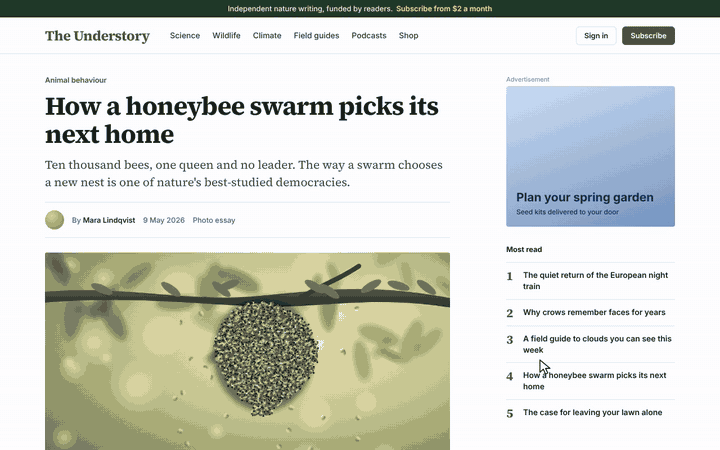

<p align="center">
  <a href="https://shmidtqq65.github.io/blueprint/">
    <picture>
      <source srcset="assets/demo.webp" type="image/webp">
      
    </picture>
  </a>
</p>

<h1 align="center">BLUEPRINT</h1>

<p align="center"><b>Print any website as a blueprint.</b></p>

<p align="center">
A copier light scans down the page and redraws it as a cyanotype: every box outlined, the main blocks<br>
dimensioned, a title block in the corner. Hover to measure. Press <kbd>Esc</kbd> and the original scans back in.
</p>

<p align="center">
  <a href="https://shmidtqq65.github.io/blueprint/"><b>Try it now</b></a>
  &nbsp;·&nbsp;
  <a href="#install">Install</a>
  &nbsp;·&nbsp;
  <a href="#controls">Controls</a>
  &nbsp;·&nbsp;
  <a href="#how-it-works">How it works</a>
</p>

<p align="center">
  
  
  
  
</p>

---

## What it does

BLUEPRINT turns the page you are looking at into a technical drawing of itself, and then gives the page back.

- **The print.** A copier light scans down the screen. Behind it the page becomes cyanotype paper with a drawing grid, the text turns to white ink and photos are printed in blue and white.
- **Outlines.** Anything with a fill, a border or a shadow is outlined by a pen that follows the light. Pictures, videos and canvases are crossed and labelled with their size. Icons turn into line drawings.
- **Construction lines.** Header, nav, main, aside, footer and the other layout containers become dashed lines with their name written in the margin. Center lines run along the edges of the main columns.
- **Dimensions and type.** The biggest distinct blocks get dimension lines with arrows and pixel values. Headings get a note with their font family, weight, size and line height.
- **Measuring.** Hover any element to see its margin and padding hatched, its size and its font. Click to pin it. With a pin, hover another element and the gap between the two is measured, the way design tools show it.
- **The sheet.** Press <kbd>S</kbd> for a PNG of the whole page: every outline, the dimensions and every word in the page's own fonts, with a title block underneath. Ready to post.
- **Nothing is rewritten.** One adopted stylesheet and a canvas on top. Press <kbd>Esc</kbd> and the original page scans back in, exactly as it was.

## Install

Pick whichever fits. All four run the same single file.

### 1. Bookmarklet (Chrome, Edge, Safari, Firefox, Arc, Brave)

1. Open the [demo page](https://shmidtqq65.github.io/blueprint/).
2. Drag the dashed **BLUEPRINT** button into your bookmarks bar. No bar? <kbd>Ctrl</kbd>+<kbd>Shift</kbd>+<kbd>B</kbd>, or <kbd>⌘</kbd>+<kbd>Shift</kbd>+<kbd>B</kbd> on a Mac.
3. Open any website and click the bookmark. Click it again (or press <kbd>Esc</kbd>) to put the page back.

GitHub can't render `javascript:` links in a README, so the button lives on the demo page. To create the bookmark by hand, make a new bookmark and paste the contents of [`bookmarklet.txt`](bookmarklet.txt) as its URL. The whole engine is inside the bookmark (about 38,000 characters, well under Firefox's 65,536 limit), so it also works on sites with a strict Content Security Policy.

### 2. Chrome extension (Chrome, Edge, Brave, Arc)

1. Download this repository (**Code → Download ZIP**) and unzip it.
2. Open `chrome://extensions` and switch on **Developer mode**.
3. Click **Load unpacked** and pick the `extension` folder.
4. Click the blueprint icon on any page, or press <kbd>Alt</kbd>+<kbd>Shift</kbd>+<kbd>P</kbd>. Press it again to put the page back. You can change the shortcut at `chrome://extensions/shortcuts`.

### 3. Console

Open DevTools on any page, paste the contents of [`blueprint.min.js`](blueprint.min.js) into the console and press Enter. Chrome and Firefox may ask you to type `allow pasting` first.

### 4. Userscript

With Tampermonkey or Violentmonkey installed, open the [raw userscript](https://raw.githubusercontent.com/shmidtqq65/blueprint/main/userscript/blueprint.user.js) and confirm the install. Then press <kbd>Alt</kbd>+<kbd>Shift</kbd>+<kbd>P</kbd> on any page, and again to put the page back.

## Controls

| Input | What it does |
| --- | --- |
| Hover | Measure the element under the cursor: margin and padding, size, font |
| Click | Pin the measurement. Hover another element to see the gap between them |
| <kbd>S</kbd> | Save the whole page as a PNG sheet (or **SAVE PNG** in the title block) |
| <kbd>G</kbd> | Grid on or off |
| <kbd>D</kbd> | Dimension lines on or off |
| <kbd>P</kbd> | Clear the pins |
| <kbd>Esc</kbd> | Scan the original back in and switch BLUEPRINT off |

Links and buttons don't fire while the page is drawn: a click pins a measurement instead. Shortcuts are ignored while a text field has focus. If your own page has a button that switches BLUEPRINT on and off, give it a `data-blueprint-ignore` attribute and its clicks will go through.

## How it works

BLUEPRINT is one dependency-free script (`src/blueprint.js`, about 37 KB minified). A few details that make it work on real sites:

- **Measure first, then print.** Before anything changes, every element is measured and classified with its original styles: boxes with a fill, a border or a shadow, form fields, media, background images, rules and layout containers. The classification is kept, because once the page is blue every background is transparent.
- **One stylesheet, no DOM rewrites.** The cyanotype look is a single constructed stylesheet adopted by the document and by every open shadow root: transparent fills, white ink, dotted links, media filtered and blended with `screen`. No attributes, classes or inline styles are added to the page, so React, Vue and friends keep running underneath, and taking the sheet off restores the page exactly.
- **The copier light.** The switch happens inside a [View Transition](https://developer.mozilla.org/docs/Web/API/View_Transition_API) whose new state is revealed from the top with a `clip-path` animation. The light and the pen on the canvas wait for the browser's snapshot, so they stay in step with the reveal. <kbd>Esc</kbd> runs the same transition the other way.
- **Drawing.** A canvas overlay draws the outlines with a dash offset, so they appear as if plotted, plus the dimension lines, the margin labels, the center lines, the rulers and the inspector. Sticky headers and fixed bars keep a sheet of paper behind them, and the outlines that scroll under them are clipped away. Outlines inside scroll boxes are clipped to their box and measured again when the box stops scrolling.
- **The PNG sheet.** The sheet is drawn from the measurements, not from a screenshot: outlines and dimensions, then every word placed where the browser laid it out, in the page's own font and stretched to the width the page gave it. Sticky parts are measured where they sit in the page. Form fields show their placeholder or chosen option, never what someone typed.
- **Strict CSP friendly.** No `eval`, no `innerHTML`, no remote code, no network requests. Styles go through constructed stylesheets.

### Browser support

| Browser | Status |
| --- | --- |
| Chrome, Edge, Brave, Arc 111+ | Everything, including the copier light |
| Safari 18+ | Everything |
| Firefox 144+ | Everything |
| Firefox 101+, Safari 16.4+ | Works, but the page turns blue at once instead of scanning |

With reduced motion switched on in the system settings, the light and the pen are skipped and the drawing simply appears. The automated tests run in Chromium.

### Privacy

No analytics, no storage, no servers: the script never sends anything anywhere and loads nothing. The sheet is drawn in your tab and only leaves it when you press <kbd>S</kbd> and save it yourself. Everything is gone when you press <kbd>Esc</kbd> or reload. The demo site loads no third-party scripts or fonts.

## Development

```bash
npm install          # terser for the build, playwright for the tests
npm run build        # src/blueprint.js -> blueprint.min.js, bookmarklet.txt, extension/, userscript/
npm test             # headless smoke test: print, measure, save, Esc, compare markup and pixels
npm run demo         # renders demo.mp4, assets/demo.webp and assets/demo.gif frame by frame (needs ffmpeg)
```

Once it runs, the engine exposes a small API on `window.__blueprint`:

| Call | Does |
| --- | --- |
| `toggle()` | Scan the original back in and switch off (same as <kbd>Esc</kbd>) |
| `stop()` | Restore instantly and switch off, no animation |
| `save(download)` | Draw the PNG sheet. Resolves to `{ blob, width, height }`; downloads it unless `download` is `false` |
| `hover(x, y)` | Measure the element at viewport coordinates |
| `pin(x, y)` | Pin the element at viewport coordinates |
| `state()` | Phase, number of outlines, dimensioned blocks, headings and pins, grid and dimension switches |

Options can be set before the script loads through `window.__BP_OPTIONS`, for example `{ grid: false, dims: false, ui: false, credit: false, motion: false }`. Setting `window.__BP_MANUAL = true` stops the animation loop so tests can drive frames with `step(dt)`.

```
blueprint/
├── index.html            demo page (GitHub Pages)
├── blueprint.min.js      built engine
├── bookmarklet.txt       built bookmarklet
├── src/blueprint.js      readable source
├── extension/            Chrome extension (Manifest V3)
├── userscript/           Tampermonkey / Violentmonkey script
├── demo/                 a sample magazine page to try it on
├── scripts/              build and demo recorder
├── test/                 smoke test and fixture pages
└── assets/               demo media, icon, fonts
```

## License

MIT © 2026 [shmidt](https://x.com/shmidtqq). Made by [@shmidtqq](https://x.com/shmidtqq). Fonts in `assets/fonts` and `demo/fonts` are under the SIL Open Font License.

If you print something good, post the sheet and tag me.
